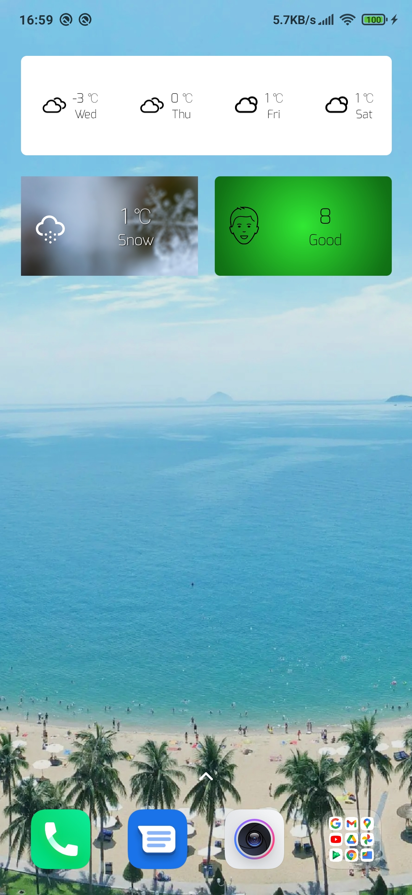
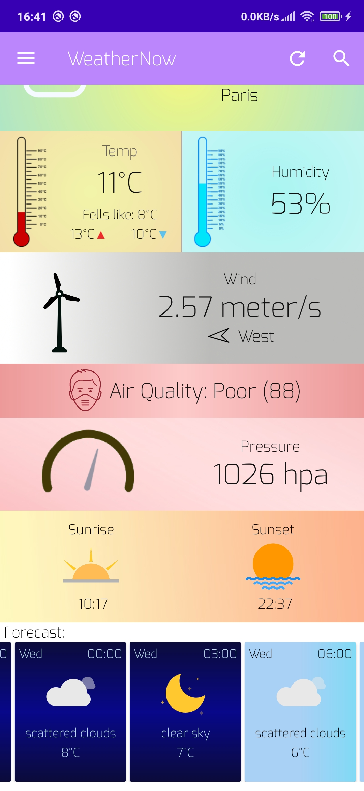

# WeatherNow is a weather application for Android. 
# Features
- Current and 5 day forecast
- Beautiful animations
- Works online and offline
- Air pollution
- Beautiful widgets
- Search by GPS
- Audio effects

- Written in kotlin
- MVVM architecture
- DataBinding
- Libraries: Retrofit, Room, Hilt, Lottie and Lifecycle.

        
